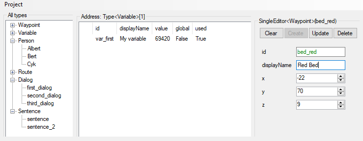

# QuestMaker

QuestMaker is an editor for entities that are used for generating files. Rules about generating those files can be set for each entity & every type. Changes (like a name of an object) in those files can be easily made by changing some properties and regenerating the project files. A built-in editor is planned to be implemented where you can write the rules.

Current use case: Makes quests for Minecraft by retrieving data files and compiling those to a Minecraft datapack.

---

---

This project is divided into 3 projects: the main project is QuestMakerConsole and the other 2 reference from it.

## QuestMakerConsole ##
Backend of the program that contains all the logic for the entities and database.

## QuestMakerUI ##
Frontend of the program that contains all the logic for the forms. 

Sends packets/commands to the backend and gets a response back from the backend and is then applied in the frontend

## QuestMakerTests ##
Unit Tests for the program.
