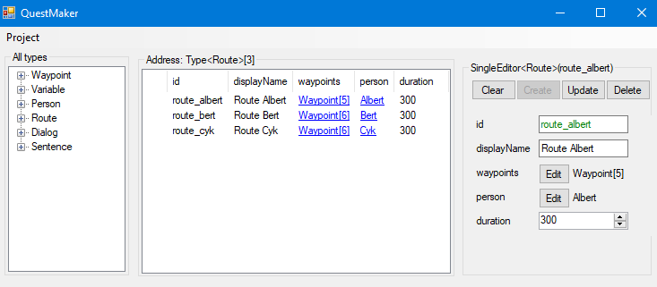

# QuestMaker

A program that is an editor and is able to generate scripts for each class and class objects. An use case for this program is  to make a quest in a game by creating a Dialog object where Person objects can interact with each other. The generated script can be used to have that dialog in-game.

You can generate any script by writing c# code for it and compiling it. (not yet  implemented!)

Current use case: Makes quests for Minecraft by retrieving data files and compiling those to a Minecraft datapack.

---

---

The projects is divided into 4 projects: the main project is QuestMakerConsole and all other 3 reference from it.

## QuestMakerConsole ##
Backend side of the program that contains all the logic for the entities and database.

## QuestMakerUI ##
Frontend side of the program that contains all the logic for the forms. Sends packets/command to the backend and gets a response back from the backend if needed (updates of UI).

## QuestMakerTests ##
Unit Tests for the program.

## Qutilities ##
A combination of the letter 'Q' and the word "utilities". Used for functions that are needed over the whole program. 
An example is getting the generic type of a list

